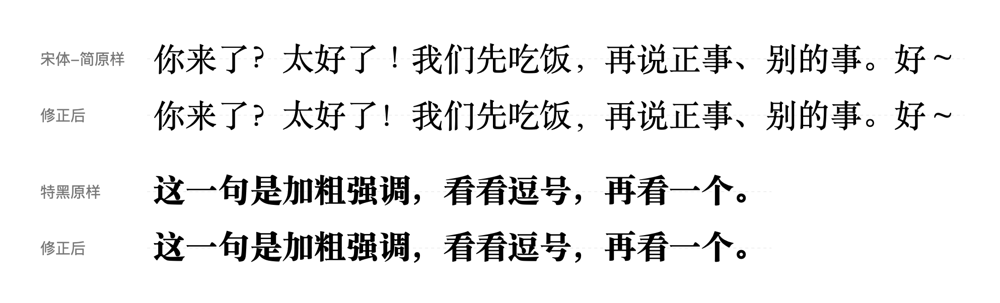
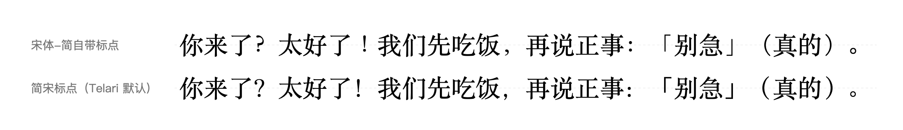
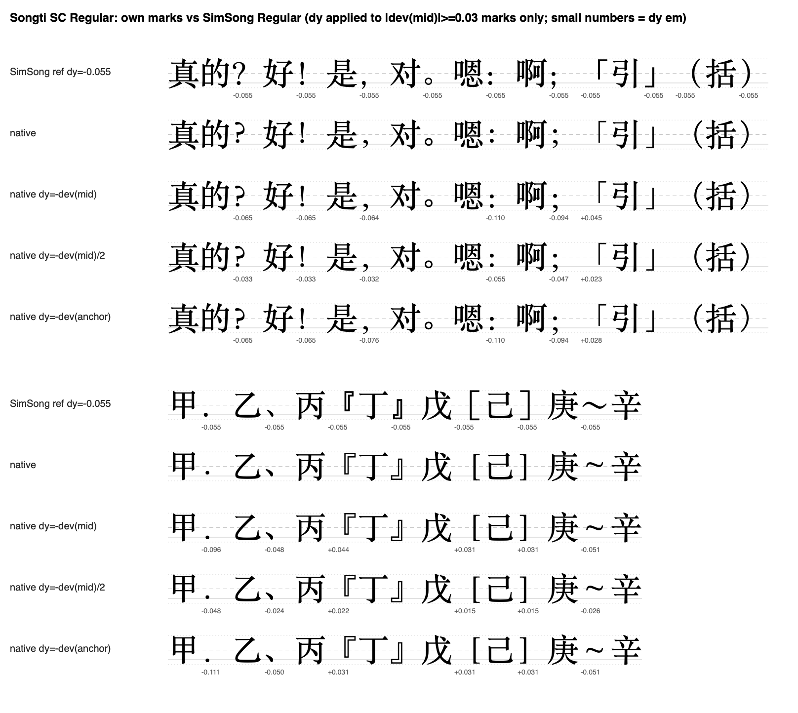
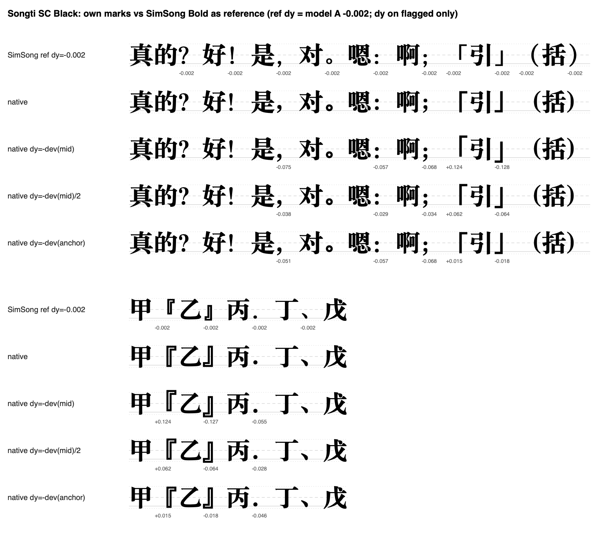

Telari 是我做的一个 Mac 上的 Markdown 阅读器，主打排版好看，尤其是中文、中英文混排的情形。目前收到了很多好评，甚至有用户自发写文章宣传。

Telari默认的中文字体是 macOS 自带的「宋体-简」（Songti SC）。用了一段时间，我总觉得它的标点有点别扭，但又说不清哪里别扭。这次花了几天把这件事查清楚、修掉了，记录一下过程。

最后的效果先放在这里：上面一行是宋体-简原样，下面一行是修正后。

## 先说一个前提：中文标点只用半个格子

中文里每个标点和汉字一样，占一个字的宽度。但标点的「墨」其实只用了半个格子：逗号、句号、问号、感叹号这类收尾的标点，墨在左半边，右半边是空的；左括号、左引号这类开头的标点，墨在右半边。

留出来的那半格空白是有用的。比如一行的最后一个字是逗号，或者「。」和「」」挨在一起，排版程序就可以把多余的半格挤掉，让版面更紧凑、更整齐。Telari 的排版引擎就是按这个规矩来算宽度和断行的。

## 第一个毛病：感叹号站在了正中间

量了一下才发现，宋体-简常规体的「！」，墨是画在格子正中间的。这是繁体中文（台湾）的标点习惯，简体中文的感叹号应该靠左。更奇怪的是，同一个字体家族里的细体、粗体、特黑，感叹号都是靠左的，只有最常用的常规体是居中的。

这不只是好不好看的问题。排版引擎以为感叹号的右半格是空的，挤压的时候就会把它挤出格子。

## 解法：整套换成「简宋」的标点

与其一个个修，不如整套换掉。macOS 其实还自带了一款「简宋」（SimSong），是华康在 2019 年为苹果做的。它的标点更规整，我让opus逐个量了一遍，所有标点都老老实实守在自己那半格里。

所以现在 Telari 的做法是：汉字还是宋体-简，只有标点换成简宋来画。这和 LaTeX 里中文排版常用的做法是一个思路——不去改字体里标点的位置，而是给标点单独指定一款字体。

这里只换了标点长什么样，每个标点占多宽、在哪里换行，一点都没变。

## 换完之后的新问题：两款字站得不一样高

换过去之后，又发现简宋的汉字整体比宋体-简高一点点，大约是一个字高的 5.5%。标点直接搬过来，就会显得偏高。

怎么量「汉字的中心在哪」，这里面也有坑。最直接的办法是把一串汉字框起来取中线，但这个框会被最高和最低的那几笔决定，不准。正确的做法是一个字一个字地量，再取平均。我们量了几百个常用字，才得出这个 5.5%。

我看了几种下沉方案的对比图，最后选了「整体下沉 5.5%」：保留简宋自己设计里，标点和汉字之间的相对位置。在常见的 16 号字上，这个距离不到 1 个点。

## 还没完：有些地方仍然用宋体-简自己的标点

有三种情况，Telari 画的还是宋体-简自带的标点：

1. **加粗强调**。Telari 的加粗默认用宋体-简的「特黑」，而简宋没有特黑，只能用特黑自己的标点。
2. 用户在设置里选了「跟随正文字体」，想要宋体-简原本的标点。
3. 少数机器上简宋被删掉了。

第一种情况其实每天都会碰到。所以这次把宋体-简三种字重的 31 个标点全部量了一遍，看它们相对自己的汉字，比简宋的设计高了多少。结果是常规和粗体的「？！，、」、常规的「～」，以及特黑的逗号，都偏高了一个字高的 4% 到 11%。

## 量的时候最容易踩的坑：到底对齐哪条边

问号、感叹号这种悬在中间的标点，看墨的中心就行。但逗号、顿号是贴着底的，要看它的底边。简宋的逗号会稍微探出汉字的底边，宋体-简的不会，要是还按中心去对，就会少挪一截。

特黑的直角引号「」是另一个例子。按中心量，它和简宋差了一个字高的 12.5%，看起来错得很离谱；可要是按边缘量，只差 1.5%。原因是特黑的引号本身就是一个又高又长的形状，和简宋的形状不一样，它的位置其实没问题。**同一组数据，换一条边来量，结论就完全相反。**

下面这张图是我用来做决定的对照：每组第一行是简宋的样子，第二行是宋体-简原样，后面几行是不同的挪法。

最后修哪些、修多少，是我看着 32 号字的对比图一条一条定的：

- 常规和粗体的「？！，、」、常规的「～」：挪到和简宋一样的位置；
- 特黑只挪逗号（还有一个很少用到的全角实心句点「．」）；
- 冒号和分号不动。宋体-简本来就把它们设计成居中，简宋的偏低，硬挪过去是换了一种风格，不是修错；
- 引号和括号不动：差得很少，或者差异来自字形本身。

不修的和修的一样重要，每一条不修都要说得出理由。

## 怎么修：只挪墨，不挪字

修正只在画的那一刻把标点的墨往下挪一点，不改它占的宽度，也不改行高。所以选中文字、光标位置、换行、行距都和原来一模一样，改的只是它看起来在哪。

另外，每一处修正都记下了这个标点现在的「长相」。Telari 每次画之前先核对一下，如果哪天苹果更新字体、改了这个标点，修正就自动停用，不会把已经被苹果修好的标点再往下推。之前那个居中的感叹号也是同样的处理。

## 最后

这些地方，大多数人看了也说不出哪里不对，但一篇长文章读下来，差别是能感觉到的。我觉得这就是做一个阅读器该下的功夫。

这些改动在 Telari 0.5.2 里，可以在 telari.app 下载，已经装了的会收到自动更新。如果你更喜欢宋体-简原来的标点，设置 ▸ 排版方案 ▸ 字体 ▸「中文标点」里可以切回「跟随正文字体」。

本文由claude opus 5起草，作者修订后发布。
