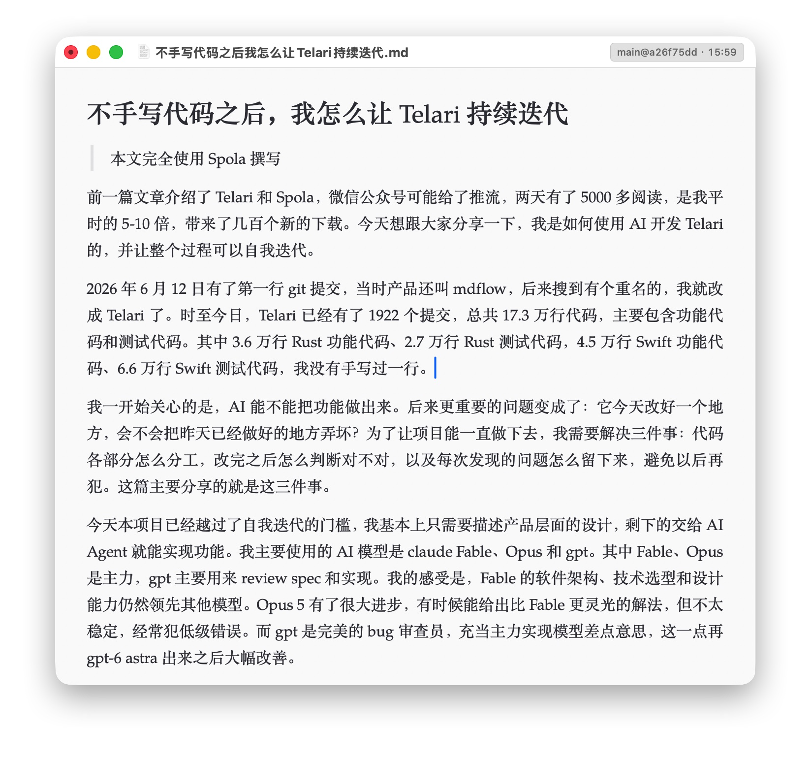

本文完全使用Spola撰写。

前一篇文章介绍了Telari和Spola，微信公众号可能给了推流，两天有了5000多阅读，是我平时的5-10倍，带来了几百个新的下载。今天想跟大家分享一下，我是如何使用AI开发Telari的，并让整个过程可以自我迭代。

2026年6月12日有了第一行git提交，当时产品还叫mdflow，后来搜到有个重名的，我就改成Telari了。时至今日，Telari已经有了1922个提交，总共17.3万行代码，主要包含功能代码和测试代码。其中3.6万行Rust功能代码、2.7万行Rust测试代码，4.5万行Swift功能代码、6.6万行Swift测试代码，我没有手写过一行。

我一开始关心的是，AI能不能把功能做出来。后来更重要的问题变成了：它今天改好一个地方，会不会把昨天已经做好的地方弄坏？为了让项目能一直做下去，我需要解决三件事：代码各部分怎么分工，改完之后怎么判断对不对，以及每次发现的问题怎么留下来，避免以后再犯。这篇主要分享的就是这三件事。

今天本项目已经越过了自我迭代的门槛，我基本上只需要描述产品层面的设计，剩下的交给AI Agent就能实现功能。我主要使用的AI模型是claude Fable、Opus和gpt。其中Fable、Opus是主力，gpt主要用来review spec和实现。我的感受是，Fable的软件架构、技术选型和设计能力仍然领先其他模型。Opus 5有了很大进步，有时候能给出比Fable更灵光的解法，但不太稳定，经常犯低级错误。而gpt是完美的bug审查员，充当主力实现模型差点意思，这一点再gpt-6 astra出来之后大幅改善。

最初Telari的核心是Knuth-Plass断行算法求解器，但今天这个求解器只有1900行代码。排版的重心已经不在于断行算法本身，而是围绕断行的输入进行的文本解析和字体处理。断行算法解决的是：一段文字在哪里换行，能让整段看起来更匀称。但在计算之前，程序得先知道每个字实际占多宽，哪些地方能断，哪些标点不能放在行首，公式要占多少空间。前面的信息不准确，后面的算法再好也排不对。

我认为最成功的一点是当前软件架构的设计，Rust和Swift两条路线并行，Rust主要负责怎么算、怎么排，Swift主要负责怎么画到屏幕上、怎么跟macOS交互。这个架构的好处有两点：1. 将排版的任务解耦，界限清晰；2. 将来如果要移植Windows、Linux版本的时候，工作量会少一点。

排版结果不对时，可以先检查排版计算；窗口或交互不对时，可以检查应用这一侧，减少相互牵连。核心排版逻辑可以单独测试，不必每次都打开完整App，靠肉眼逐页检查。未来移植其他系统时，有机会复用排版核心，但界面、字体处理和系统交互仍然需要适配。

如何保证排版的效果是正确的？

其实排版的效果没有唯一答案，因为排版带有主观审美，但也有很多细节可以客观检查。比如同一个公式应该选哪个形状的括号，上标应该放在哪里，分数线应该有多长。排版领域有一座几乎不可逾越的高山：LaTeX。我的主要工作之一就是想到了一条管线，让Telari的排版结果能和LaTeX像素级匹配。

我制造了大量的测试样例，然后给Telari和LaTeX相同的字体配置和相同的排版设置，然后让Telari输出的结果和luatex进行位级别的对比，完全相同才算是测试通过。

然后我再肉眼进行判断。

这个方法非常奏效，尤其是对于数学公式的排版开发。有了这套流程，开发的难点主要就是覆盖各种边边角角的例子了。

排版的魔鬼都在细节里面，各种边缘case实在是太多了。

现在这套流程搭建起来之后，基本上我每天的开发工作就是使用自己的App。遇到有Bug的地方，我就打开一个claude session，然后描述我的Bug或者进行截图发给他，让他去开一个GitHub Issue。

现在已经积累了几百个Issue，待处理的大概有一两百个，每天就是去消灭这些Issue，至于具体的代码，我自己已经完全不看了，完全是根据结果来进行验收。

到了Spola编辑器，我又遇到了这套方法的边界。公式排版还能拿成熟引擎来对照，编辑手感却经常需要我先说清楚：按下这个键以后，文字应该怎样变化，光标应该停在哪里。

所以我现在虽然不再逐行看代码，但仍然需要做很多判断：做什么、什么表现算对、哪些差异可以接受，以及什么时候算完成。我对AI开发最大的体会是，验收标准越清楚，AI越容易持续把事情做好。每解决一个问题，如果还能留下一个以后可以重复检查的例子，下一次修改就多了一份保障。
