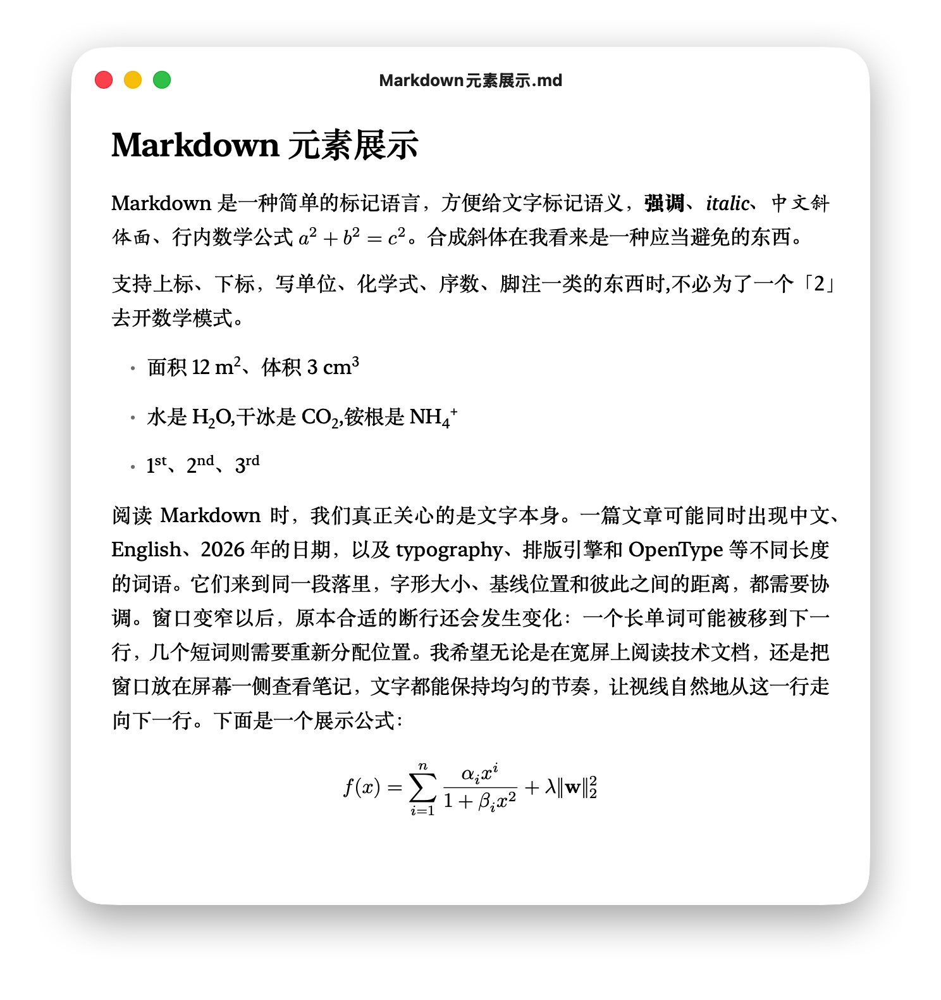
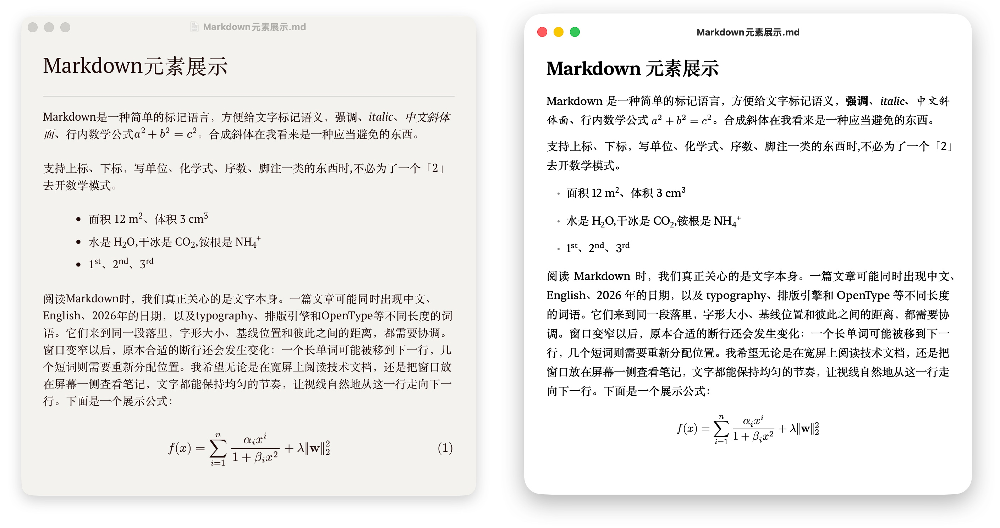

经过两个多月的更新，我决定来为Telari写宣传文稿。

Telari是一款Markdown阅读器，没有编辑功能，只是阅读已经存在的Markdown文件。

网址：[telari.app](https://telari.app)

我思索了很久怎么宣传，我觉得目前它已经达到了我目标的雏形：

**Markdown排版该有的样子。**

## 阅读体验

现在市面上很多Markdown阅读器、编辑器都是web套壳，有一些颜值已经很高、编辑体验也打磨得十分完善，比如Typora。但这些编辑器在一些排版的细节上做得仍然不好，例如：

- 段落断行、对齐算法不够好
- 中英文自动间距没有处理
- 没有中文标点压缩
- 中西文的字体缺少微调选项，比如基线高度、大小搭配

有些人对这些细节不敏感，有些人比较在意，比如我，而且我相信这个群体比例并不小，不然不会出现「[中文排版需求](https://www.w3.org/TR/clreq/)」这样的努力。

Telari做到的，就是在这些细节上前进一步，让文字更优美，让阅读更顺畅、愉悦。

下图左边是Typora，右图是Telari。严谨来说，Typora里面也应该设置 `text-align: justify`，但这里图省事，都用了两个app内置的衬线主题。

## 对齐、断行、字体

首先是两端对齐算法，Telari采用了TeX使用的Knuth-Plass段落断行算法，它会全局寻找最佳断行点并调整字词间距，以达到最佳的视觉效果。浏览器在这方面仍然没有达到我想要的效果，虽然最近 `text-wrap: pretty`、`text-autospace` 已经有了发展，但细节还不能让我满意。

比如中文标点压缩，压缩的是标点周围的空白，而不是把逗号、句号本身挤瘦。中西文自动间距也发生在显示阶段，不需要为了排版效果去修改原文、手动补空格。

字体的搭配同样重要，同样的字号并不意味着中文和西文看起来一样大；共用一条基线，也不意味着两者在视觉上就对齐了。Telari允许分别选择字体，并对混排时的位置进行微调。我希望它们放在一起的时候，看起来像同一段文字，而不是两套字体临时拼在一起。

由于Telari现在只有macOS版本，所以可以充分发挥macOS字体的优势。断行、字符位置需要字体侧的配合，甚至字体才是核心的核心。我不是字体专家，而macOS是这方面的标杆，我站在它的肩膀上来前进。macOS的CoreText为这些工作提供了很好的基础：字形塑形、字体度量和最终绘制都建立在它之上，Telari再负责自己的断行、间距和布局规则。

## 数学公式

数学公式这部分，我选择自己做排版引擎。我希望能直接控制公式里每个符号的位置，让它的字体、基线、留白与正文一起协调。

引擎读取OpenType字体中的MATH表，然后排版公式。数学公式的语法支持LaTeX的一套子集。

Telari会先把LaTeX数学语法解析成公式结构，识别分数、根号、上下标、矩阵等内容，再逐层计算它们的大小和位置。最终，Rust输出排好位置的字形和线条，由Swift调用macOS的原生绘图能力画出来。阅读时不需要在后台启动TeX，也不需要借助WebView显示公式。

这里很有意思的一点是：数学字体不只是存着一套符号的轮廓，还带着很多排版信息。OpenType的MATH表会告诉排版引擎，分数线应该多粗、上下标应该留多少距离、重音符号应该对准哪里，以及大括号和根号怎样随着内容变大。

所以，排一个公式远不止是把字符按顺序摆出来。上标不只是把普通字符缩小：字体提供了适合小尺寸的字形变体时，引擎还需要选择它们。括号也不只是把小括号拉长：需要先寻找字体里合适的大尺寸字形，超过现成尺寸后，再按照字体提供的部件和连接规则拼接。

这些细节单独看都很小，但叠在一起，就决定了公式是勉强可读，还是看起来协调、自然。

目前Telari内置了New Computer Modern Math的Regular、Book两种版本，以及TeX Gyre Pagella Math，可以选择不同的数学字体风格。语法支持的是LaTeX数学语法的一个子集，仍然在持续补充。

## 反馈与开发

我收到了不少用户的反馈，说我做的这个东西真的漂亮、审美很高。

我非常开心，得到认可的成就感与我用Telari来阅读优美文字的快感不相上下。

在此之前，我没有进行过大规模宣传，只在B站发了一个视频、在知乎写了篇简短的文章，然后获得了1000次出头的安装量。我看了眼后台数据，目前留存率有70% 多。

此前不大规模宣传是因为觉得app还很不完善，基本只是实现了想法验证。但不宣传也不行，因为需要真实的用户反馈，几百上千这个量级不错，很多用户都给我提了非常宝贵的意见。

现在Telari已经来到了0.4.5的版本，虽然还是有很多不完善的地方，但也可以扩大宣传了。我的目标自然是让更多人用上，如果顺便能够赚点钱就完美了。

开发方面，Telari在macOS的字体和绘图能力之上，自行实现了一套面向Markdown阅读的排版引擎。这个工作量还是相当可观的，好在有AI。

我印象中我没有人肉写过一行代码，都是Claude和GPT的功劳。排版相关的代码是Rust，字体、GUI交给Swift。我的主要工作量就是描述我想要什么，然后找到合适的测试例子，找到合适的验证方法让AI知道自己做的是对还是错。

这里LaTeX几乎是金标准，断行和数学公式等关键环节都要和LaTeX进行比较，这个方法异常奏效。

即便如此，重做排版引擎也不是简单的事情，为此投入的Claude Max和GPT Pro账号也至少有10个月量级了。而且用token开发，软件长出来也需要时间，AI时代软件也不是言出法随的，只是验证想法更快了。

当我想法描述清晰的时候，AI指哪打哪；描述得不够清晰、或者自己也没想清楚关键所在，就是考验AI的时候，很多东西都要靠多试验和失败趟出来。

最后我再预告一下姐妹App Spola：Markdown编辑，所见即所得。Telari专注于阅读，Spola会将整套排版引擎带到编辑上，这个工作的难度是阅读器的10倍甚至更多，因为不能使用已有的富文本编辑组件，得从头处理光标、输入法、编辑状态等一系列问题。Telari用了两天就验证了想法，而Spola用了两个月才验证原型，让我想明白了一些关键问题，有信心能够达到心中的体验。

目前Telari已经可以在 [telari.app](https://telari.app) 上下载使用，Spola还需要一段时间。

谢谢。
